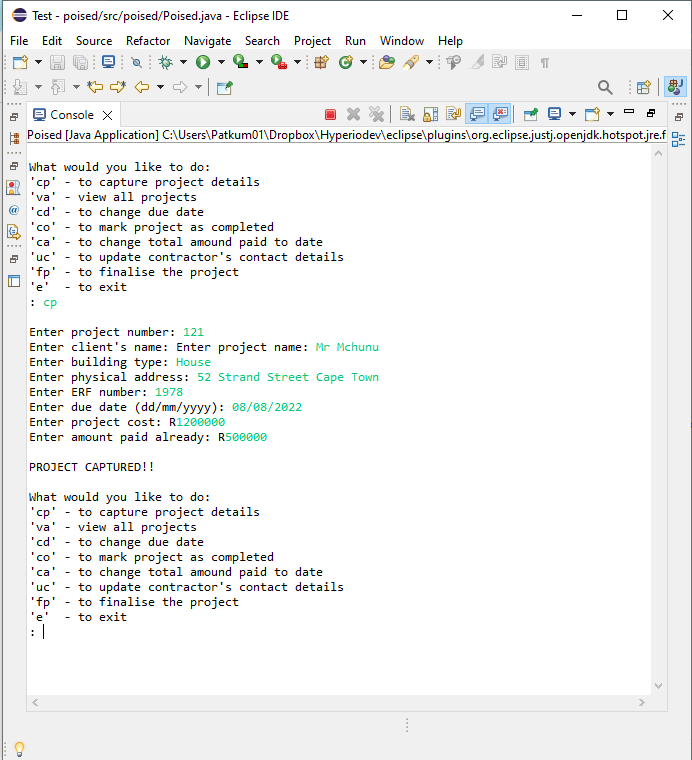
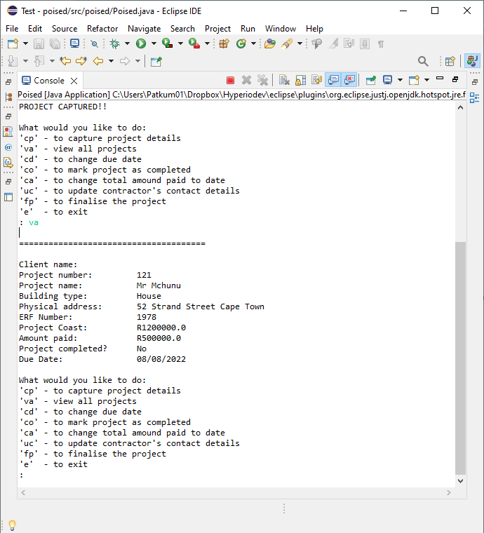
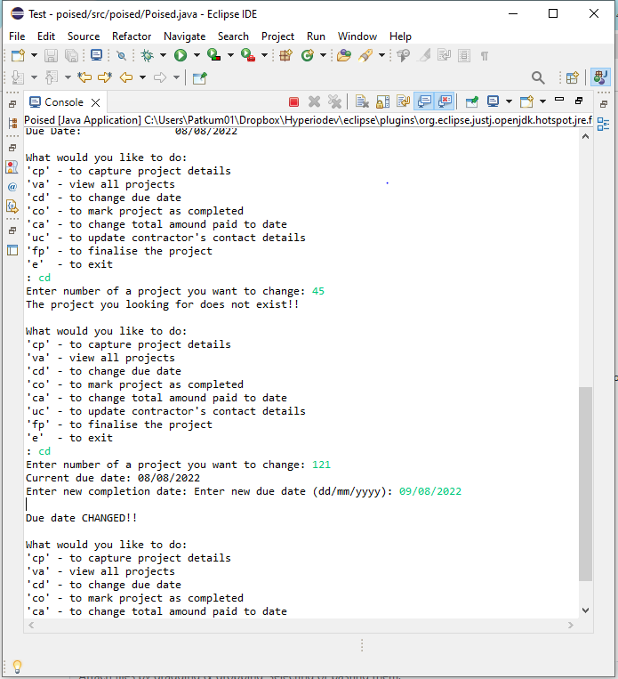
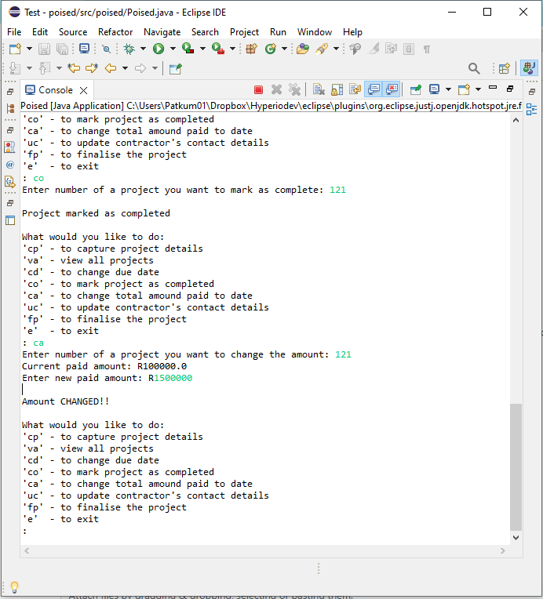

# Poised
This a project management system used by a small structural engeneering firm called "Poised". Poised does engineering needed to ensure the structural integrity of various buildings.
## TABLE OF CONTENT
* [General Info](#general-information)
* [Technologies Used](#technologies-used)
* [Features](#features)
* [Screenshots](#screenshots)
* [Setup](#setup)
* [Usage](#usage)
* [Project Status](#project-status)
* [Room for Improvement](#room-for-improvement)
* [Acknowledgements](#acknowledgements)
* [Contact](#contacts)
## GENERAL INFORMATION
The program capture project details and updated the existing ones. It also stores the information of all personel involved in the project, like contractor's information
## TECHNOLOGIES USED
* Eclipse
## FEATURES
* Capture information about new projects
* Updates information about the existing projects
* Finalise existing projects by:
  * Generating invoice
  * Marking the project as complete
* Captures contractos information
* Updated the contractors information
## SCREENSHOTS
  

## SETUP
Download all the .java files and use one of the following IDE to execute the program
This program can executed using:
* Eclipse 
* VS code
* or any java compatible IDE
## USAGE
Once all the files have been downloaded on to the single folder follow the steps below to run you program
1. Diploy/execute the program
2. The options will be displayed
3. Select on obtion by typing
4. The program will guide you into entering correct information
5. Make sure you enter correct infomation
## PROJECT STATUS
* In prograss
## ROOM FOR IMPROVEMENT
* Error handling 
* More options for the user
## ACKNOWLEDGEMENTS
This project was inspired by HyperionDev
It was based on Capstone Project 1 Level 2 Task 7
Many thanks to Ikenna Tshabalala for reviewing code
## CONTACTS
Created by mfanafuthis@hotmail.com
Cell no: 0735603009
